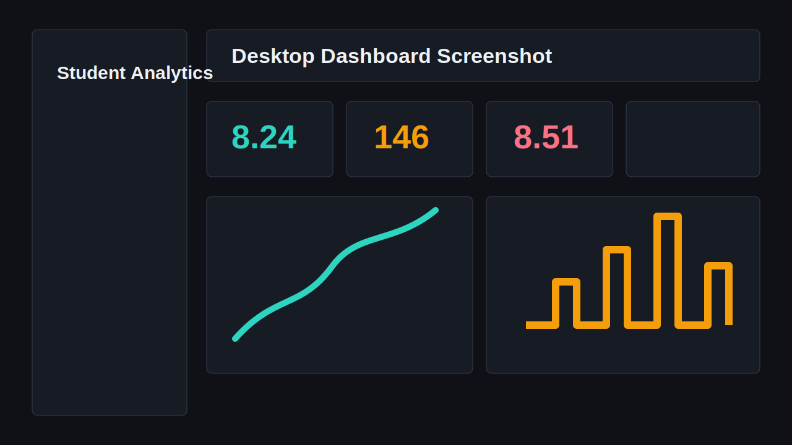
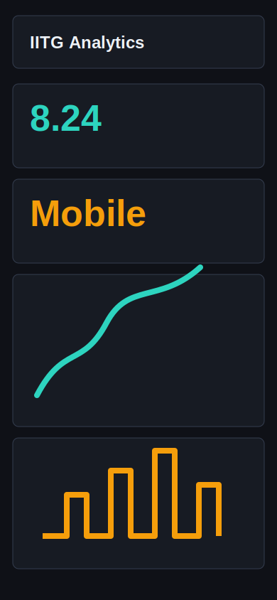
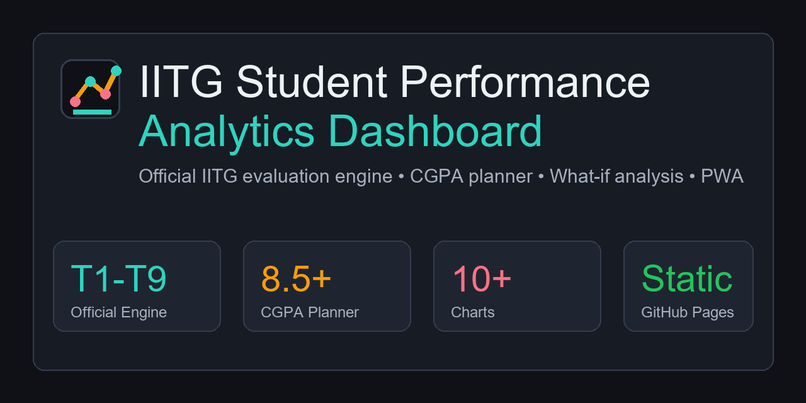

# IITG Student Performance Analytics Dashboard

A professional, GitHub Pages-ready analytics dashboard for IIT Guwahati BSc (Hons.) Data Science & AI students. The app helps students calculate course grades, track trimester performance, view the curriculum, compare semesters, forecast GPA trends, and export portfolio-ready reports.

## Portfolio Description

This project transforms a simple grade calculator into a polished student analytics platform built with pure HTML, CSS, and vanilla JavaScript. It demonstrates frontend engineering, data visualization, local-first architecture, responsive UI design, offline support, and practical academic analytics without using a backend.

## Features

- Static GitHub Pages deployment
- Course support for trimesters 1 to 9
- Searchable syllabus viewer with trimester, course, and type filters
- Official IITG evaluation engine for trimester 1-6 and trimester 7-9 rules
- Configuration-driven Grade Lab generated from `data/assessment-rules.json`
- Mobile-first assessment cards with live included/dropped status
- Beginner Mode with guided steps for first-year students
- Hidden Rule Manager for custom evaluation schemes and future IITG rule changes
- Configurable assessment types, counts, maximum marks, weightages, and best-of selection counts
- Dedicated AA and AB what-if requirement cards
- GPA, SGPA, CGPA, grade, and credit tracking
- Semester comparison dashboard
- GPA trend forecasting
- Local AI-style study recommendations
- Curriculum completion and next-course planning
- Academic health and portfolio-readiness signals
- Editable local grade-scale thresholds
- Saved course-result manager
- Online/offline status indicator
- What-if analysis for future assessment marks
- Target CGPA predictor for the next 1, 2, and 3 trimesters
- Dynamic component trend, assessment comparison, contribution, forecast, and heatmap analytics
- Strength, weak-topic, recommended-focus, and grade-prediction study coach
- Professional favicon, PWA icons, and social preview image
- Chart.js visualizations
- Export data to JSON
- Import data from JSON
- Export dashboard report to PDF with jsPDF and html2canvas
- Print dashboard and report views
- Export rendered charts as PNG, JPEG, or SVG summaries
- Local Storage persistence
- Theme persistence
- Responsive mobile dashboard
- Installable PWA
- Offline support after first load

## Official Evaluation Rules

Trimester 1 to Trimester 6:

- Assessments: PT1-PT6 and NPT1-NPT6
- Selection: best 5 PTs and best 5 NPTs
- Dropped: lowest PT and lowest NPT
- Weightage: PT 90%, NPT 10%

Trimester 7 to Trimester 9:

- Assessments: NPT1-NPT12, PT1-PT2, ST1
- Selection: best 10 NPTs, both PTs, and ST
- Dropped: lowest 2 NPTs
- Weightage: NPT 10%, PT 40%, ST 50%

All marks, counts, weightages, best-of values, and assessment types are generated from `data/assessment-rules.json`. Local administrator edits are saved in Local Storage and can be exported as JSON, so future IITG rule changes can be handled by replacing the rules JSON file without changing JavaScript.

## Folder Structure

```text
iitg-student-performance-dashboard/
|-- index.html
|-- styles.css
|-- script.js
|-- manifest.webmanifest
|-- sw.js
|-- data/
|   |-- courses.json
|   |-- syllabus.json
|   |-- assessment-rules.json
|-- assets/
|   |-- screenshots/
|   |   |-- dashboard-placeholder.svg
|   |   |-- mobile-placeholder.svg
|   |   |-- social-preview.png
|   |-- icons/
|       |-- icon.svg
|       |-- icon-192.png
|       |-- icon-192.svg
|       |-- icon-512.png
|       |-- icon-512.svg
|-- README.md
|-- LICENSE
|-- .gitignore
```

## Deployment Instructions

1. Create a GitHub repository.
2. Push all files from `iitg-student-performance-dashboard`.
3. Go to repository `Settings`.
4. Open `Pages`.
5. Set `Source` to `Deploy from a branch`.
6. Set `Branch` to `main`.
7. Set folder to `/root`.
8. Save.

The app works immediately on GitHub Pages because it uses only static files and CDN-based libraries.

## Resume Description

Built a production-ready IITG Student Performance Analytics Dashboard using HTML, CSS, and vanilla JavaScript with Local Storage persistence, official IITG grade evaluation rules, GPA/CGPA forecasting, Chart.js analytics, PWA offline support, and PDF/JSON/chart export workflows.

Suitable for Data Analyst, Data Science, Frontend Developer, and Digital AI internship portfolios because it combines domain-specific analytics, product thinking, UI engineering, and privacy-preserving local-first architecture.

## LinkedIn Project Description

I created a local-first academic analytics platform for IIT Guwahati BSc Data Science and AI students. The project supports official trimester-specific evaluation rules, dynamic assessment configuration, syllabus exploration, CGPA planning, what-if analysis, offline PWA installation, and portfolio-ready exports with zero backend dependencies.

## Local Preview

Use any static file server from the project folder:

```bash
python -m http.server 8080
```

Then open:

```text
http://localhost:8080
```

## Screenshots

Replace these placeholders after deployment:







## GitHub Topics

```text
iitg
data-science
student-dashboard
grade-calculator
gpa-calculator
cgpa-calculator
chartjs
vanilla-javascript
localstorage
pwa
github-pages
frontend
analytics-dashboard
portfolio-project
iitg-dsai
academic-analytics
progressive-web-app
```

## Notes

- All user-entered academic data is stored in the browser through Local Storage.
- The included demo records can be reset from the Data page.
- The app does not require Node.js, Express, MongoDB, MySQL, PHP, Python, or any backend service.
- Forecasting and recommendations run locally in the browser.

## License

This project is licensed under the MIT License. See [LICENSE](LICENSE).
